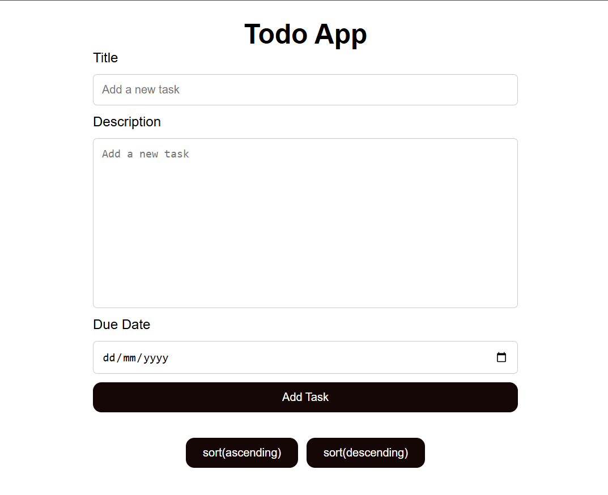

# Week 1.3

## Lab Activity: Interactive To-Do List with Due Time and Sorting

### Learning Objectives

- Master DOM manipulation to dynamically create, update, and remove elements in the
  to-do list.

- Utilize JavaScript data structures (e.g., arrays, objects) to store and manage to-do items.
-Implement sorting algorithms to order to-do items by due time or other criteria.
- Gain experience with user input handling, form validation, and date/time manipulation.
### Scenario:
Build a to-do list application that allows users to:
- **Create** new to-do items with a title, description (optional), and due date/time.
- **Read** the list of to-do items, and display them in a clear and organized manner.
- **Update** existing to-do items (title, description, due date/time).
- **Delete** to-do items.
- **Sort** the to-do list by due date/time (ascending or descending).
- **Mark** to-do items as complete.

### Tasks:
1. HTML Structure:
   - Create the basic HTML structure for the to-do list:
     - Input fields for title, description, and due date/time.
     - A button to add new items.
     - A container to display the list of to-do items.
     - (Optional) Buttons for sorting and filtering.
2. JavaScript Functionality:
   - Data Storage
     - Use an array to store to-do item objects.
     - Each object should have properties for title, description, due
       date/time, and completion status 
   - DOM Manipulation
      - Write functions to
        1. Create new to-do list item elements from the data.
        2. Add new items to the list.
        3. Update existing items in the list.
        4. Sort the list based on the due date/time.
3. Event Handling
   - Add event listeners to:
     1. The “add” button to trigger item creation.
     2. List items for editing and deleting.
     3. Sorting and filtering buttons.
4. Date/Time Handling:
  - Use JavaScript’s Date object or a library like Moment.js to work with
    due dates/times.
  - Ensure proper formatting and validation of date/time input.
