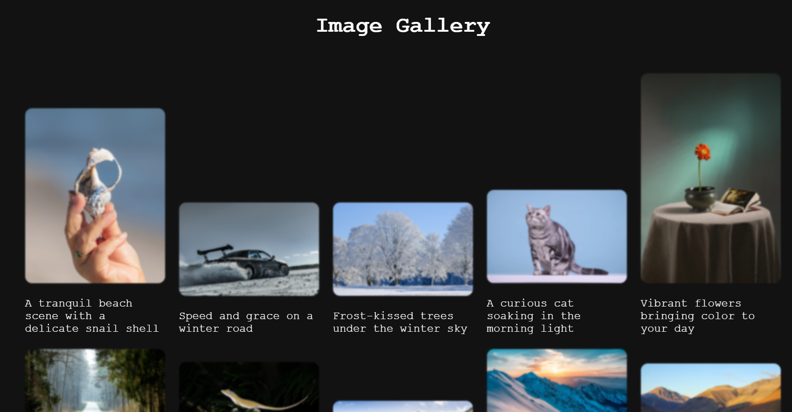
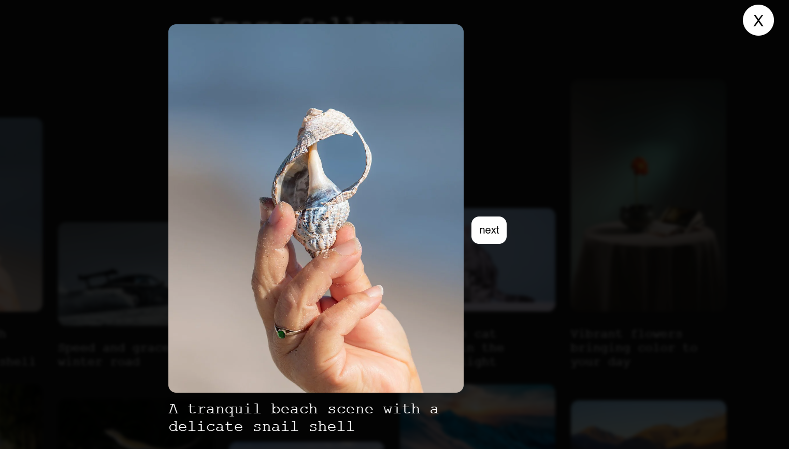

# Week 1.4

## Lab Activity: Interactive Image Gallery with Lightbox, Captions, and Navigation

### Learning Objectives

- Master DOM manipulation to dynamically create, modify, and interact with image gallery
  elements.
- Practice event handling to trigger actions like opening the lightbox, navigating between
  images, and closing the lightbox.
- Utilize JavaScript data structures (e.g., arrays, objects) to store and manage image data.
- Gain experience with CSS styling to create visually appealing layouts and effects.

### Scenario:
Build an interactive image gallery that displays a thumbnail grid of images. When a
thumbnail is clicked, it should open a lightbox that displays the full-sized image along
with its caption. The lightbox should have "Next" and "Previous" buttons for navigation
between images.

### Tasks:
1. HTML Structure:
   - Create the basic HTML structure:
       - A container for the image gallery.
       - Thumbnail elements with attributes pointing to the thumbnail images.
       - Alt text for accessibility and captions.
       - The lightbox container is initially hidden.
       - Elements within the lightbox:
         1. Full-sized image container.
         2. Caption container.
         3. “Next” and “Previous” buttons.
         4. Close button.
2. CSS Styling:
   - Style the gallery to your liking:
       - Thumbnail grid layout (e.g., using Flexbox or CSS Grid).
       - Lightbox overlay effect (e.g., darkening the background).
       - Lightbox content positioning (e.g., centered).
       - Button styles and hover effects.
3. JavaScript Functionality:
   - Image Data:
     - Create an array or object to store image information:
       1. Image URL (full-size)
       2. Thumbnail URL
       3. Caption

   - DOM Manipulation:
        - Write functions to:
          1. Dynamically create thumbnail elements and add them to the
             gallery container.
          2. Open the lightbox when a thumbnail is clicked:
             - Display the full-sized image in the lightbox container.
             - Update the caption in the lightbox.
          3. Handle navigation (next/previous buttons):
             - Load the correct image and caption based on the current
             index.
             - Disable buttons at the beginning and end of the gallery.
          4. Close the lightbox.
   - Event Handling:
        - Add event listeners to:
          1. Thumbnails (click to open lightbox).
          2. Next and Previous buttons (click to navigate).
          3. Close button (click to close the lightbox).
   - Date/Time Handling:
     - Use JavaScript’s Date object or a library like Moment.js to work with
              due dates/times.
     - Ensure proper formatting and validation of date/time input.
